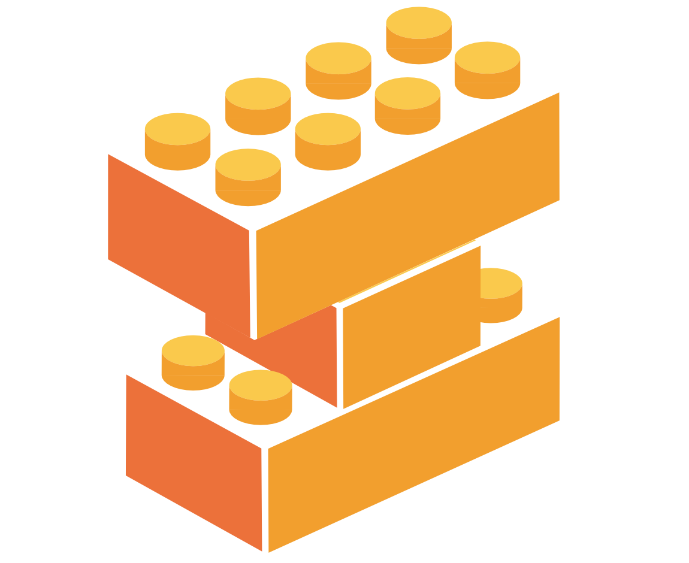

# LatentLego - flexible latent spaces for single cells



LatentLego is a python library for building autoencoders for single-cell genomics. It is build on top of [TensorFlow](https://www.tensorflow.org/) and [Keras](https://keras.io/) and provides modular components to build common single-cell autoencoder architectures. All individual comonents are valid Keras `Layer` or `Model` objects and therefore support model construction using the standard Keras (functional/sequential) API. There is also a model zoo of preconstructed models that understand builtin Keras methods like `.fit()` or `.predict()` and `.compile()` with custom loss functions.

## Installation

You can install LatentLego from [PyPI](https://pypi.org/project/latent/) using `pip`

```python
pip install latent
```

or install the development version from GitHub

```python
pip install git+https://github.com/quadbio/latent-lego
```

## Overview

LatentLego is like a lego box with building blocks for autoencoders. Here's an overview:

* `latent.models` - Here you can find Keras-compatible implementations of common single-cell autoencoder architectures, such as the `ZINBAutoencoder` ([Erslan 2019](https://www.nature.com/articles/s41467-018-07931-2)) or the `NegativeBinomialVAE` ([Lopez 2018](https://www.nature.com/articles/s41592-018-0229-2)). I also implemented some more experimental architectures like the `TopologicalAutoencoder` ([Moor 2019](https://arxiv.org/abs/1906.00722)).

* `latent.modules` - Here live the lower level building blocks of autoencoders, namely `encoder` and `decoder` models that can be freely assembled to produce autoencoder models. E.g., using a `VariationalEncoder` with a `PoissonDecoder` produces a `PoissonVAE`, a variational autoencoder with a poisson reconstruction loss.

* `latent.layers` - These are the most basic building blocks of `encoder` and `decoder` models. In addition to the `DenseBlock`/`DenseStack` layers that are the core component of encoders and decoders, I implemeneted some other useful utility layers.

* `latent.losses`, `latent.activations`, `latent.callbacks` - Keras-style components that are useful for single-cell data, like a `NegativeBinomial` loss or a `KLDivergenceScheduler` callback function. All of these should work nicely within the TensorFlow/Keras framework.


## Documentation

If you want to find out more, check out the [Documentation](https://quadbiolab.github.io/latent-lego/).
