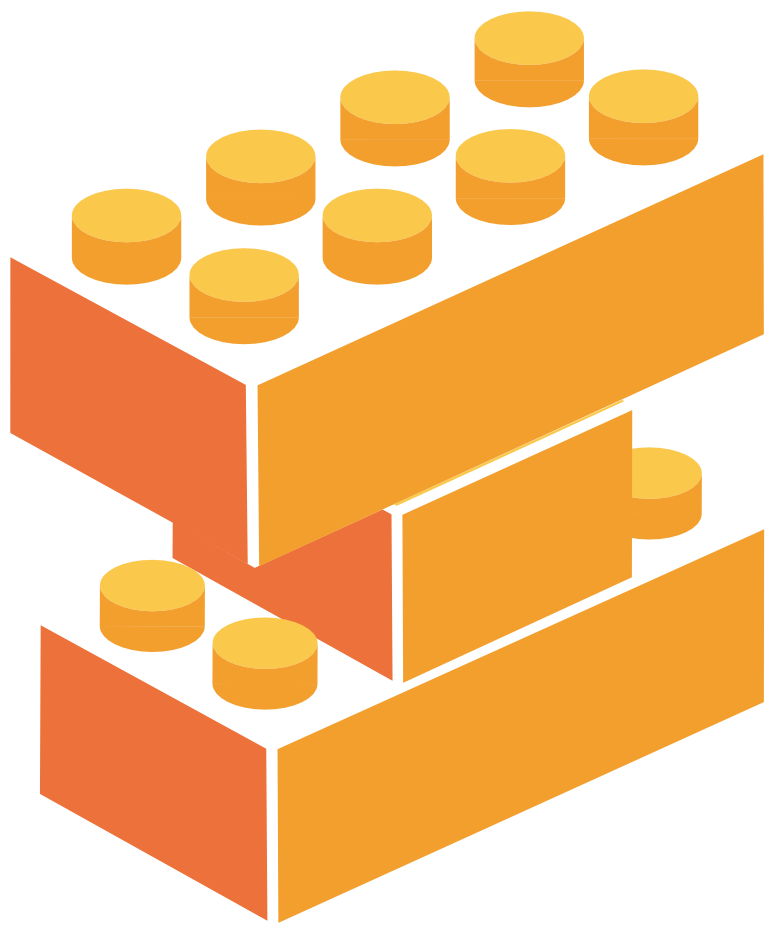

# LatentLego 

LatentLego is a python package for flexible latent space generation for single-cell genomic data using Autoencoders. It is build on top of tensorflow/keras and provides modular components to build common Autoencoder architectures from the realm of single-cell genomics. All individual comonents are valid keras layer or model objects therefore support model construction using the standard keras (functional/sequential) API. All models can also make use of builtin keras methods like `fit()` or `predict()` and `compile()` with custom loss functions.
